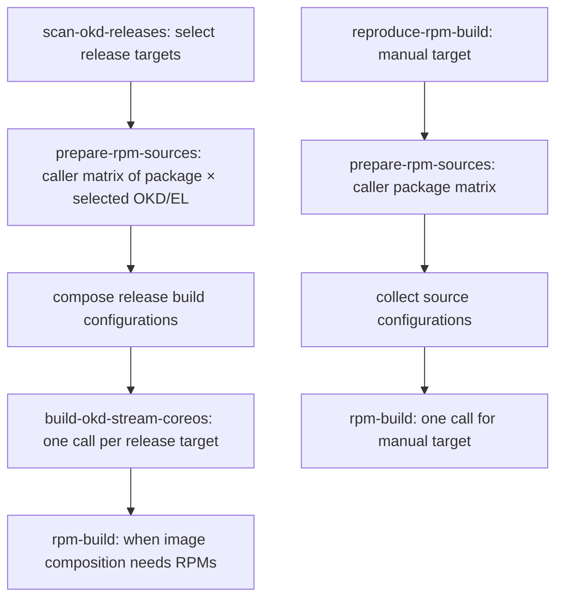

# RPM source mirror reimplementation plan

Status: implemented in the working copy. The marker commits `.mirror-patch.json`
with patch identity information. Compatibility changes are commits on the
mirror branch; no standalone local patch files are maintained.

## Basis and scope

Reimplement on the current `main` working copy (`29933518`), using the prompts
retrieved from task `da991faa-f17b-46ce-9e9f-94cb995a108b` and the
`attempt-mirror` workspace as design evidence. The attempt is based on
`72b72063` and ends at `efc63901`. Preserve the later `main` changes, including
the status-report workflow. Full session transcripts are unnecessary unless a
specific unresolved detail requires them.

The latest prompts take precedence over earlier approaches. The feature supplies
CentOS Cloud SIG RPM **source branches** for custom OKD builds. It does not add
a binary RPM hosting service.

## Required behavior

- Always build the requested SIG packages; remove `build_sig` and its gates.
- Select sources by branch availability. Prefer the exact target upstream
  branch, then a configured native shared branch for the requested EL. Use both
  directly. Otherwise maintain a compatibility branch in this repository based
  on the configured fallback upstream branch.
- Name compatibility mirrors `rpms/<project>-el<major>-<okd-version>`.
  Native shared sources, including EL9 conmon-rs, do not need mirrors.
- Retain upstream Git history, independent of `main`. Replay compatibility
  commits by rebase/cherry-pick. The first commit after the upstream base must be
  identified by the subject `PATCH/<upstream-base-branch>` and contain the
  patch identity file `.mirror-patch.json`.
- Define a stable patch identity from the package, source branch (including its
  source EL/OKD version), and target EL/OKD version. Do not include a SHA or RPM
  `Release:` in that identity.
- Use SHAs for freshness and Git transport, signing, and publication mechanics;
  do not put them into source selection or build-source configuration.
- Let the agent maintain the mirror. Workflow preparation sets up remotes and
  supplies context. Do not add post-agent spec, RPM-version, path-allowlist, or
  compatibility validation.
- The agent commits its stack to the local `mirror-patch` branch; workflow
  steps record the stack size, then publish signed commits using
  `pgaskin/push-signed-commits`.
- Keep source planning outside both RPM and image build workflows.

## Workflow graph and contracts

Each preparation call optionally invokes `sync-repo-mirror`, once for its
package target. Neither reusable source workflow owns another package or
release matrix. Both use only `workflow_call`.

| Boundary | Input | Successful result |
| --- | --- | --- |
| Release selection → preparation | Selected OKD/EL/package tuple and branch rules | Exact/native shared source branch or compatibility mirror request, identified by branches |
| Preparation → sync | One package, upstream URL/base branch, target branch, target environment, patch identity | Mirror exists and incorporates the fetched upstream head |
| Agent → publication | Stack committed on the local `mirror-patch` branch | Signed patch stack published on the target upstream history |
| Preparation → collection | Unique per-tuple source artifact, emitted only after successful preparation | `{ "<okd>/el<major>": { "<project>": { "url": "...", "branch": "..." } } }` |
| Collection → builds | Complete source map for the selected target | Build clones the supplied sources directly |

`scan-okd-releases` remains the sole entry point for this OKD image pipeline.
`reproduce-rpm-build` is the only additional entry point for RPM builds.
Keep the current image reuse, EL9 composition, and EL10 skip behavior.

## Implementation sequence

### 1. Define source rules and generic patch recipes

Add a small branch-rule configuration, provisionally `rpms/mirror-plan.json`.
Keep the active release targets unchanged. Source rules cover `cri-o`,
`cri-tools`, and `conmon-rs`, with exact, fallback, and shared branch patterns.
An absent exact branch chooses a configured native shared branch directly, or
uses the configured compatibility fallback through mirror sync. It does not
silently substitute an older OKD package version. Transport/authentication
failures must fail rather than masquerade as missing branches.

Use the attempted configuration as a starting point, then verify its branch
names. In particular, handle the shared EL9 `conmon-rs` source consistently
across OKD versions. Branch selection has one owner and runs once per requested
tuple. Do not add a second resolver to the build.

Document generic creation and update procedures in `docs/module-patch.md`.
For example, a branch-based identity could be
`cri-o__c10s-sig-cloud-okd-4.22__el9-okd4.22`. Shared targets omit the OKD target
version. Generate this identity with the same rule for every package.

Keep the CRI-O EL9 comparison as a worked example: compare 4.20 EL9 and EL10
packaging, then apply the relevant target differences to the 4.22 EL10 base.
Verify the two proposed CNI changes against that comparison. Inspect missing
EL9 packages using the same procedure; create compatibility changes only when
the evidence calls for them. Specs, `SOURCES`, and the lookaside `sources`
manifest may all need changes. Do not restrict maintenance to a single spec.

### 2. Implement reusable preparation

Add `prepare-rpm-sources.yml` for one package/OKD/EL tuple. Use inline
`actions/github-script` for deterministic branch selection. An exact upstream
branch or native shared target branch returns directly. Otherwise pass the
configured compatibility base branch and mirror identity to reusable sync.

Have sync own the mirror existence/freshness decision so preparation does not
probe the same mirror twice. For an existing mirror, fetch both histories and
use `git merge-base --is-ancestor <upstream-head> <mirror-head>` to determine
whether upstream is already incorporated. A metadata SHA equality check cannot
establish that contract. Do not introduce `.rpm-mirror.json` just to track
freshness; the marker supplies base-branch provenance.

Emit the source artifact after sync succeeds or reports no update needed. This
ordering establishes the build contract. Use artifacts for matrix fan-in rather
than reusable workflow outputs that can overwrite one another.

### 3. Implement mirror sync as one job

Add `sync-repo-mirror.yml`, accepting one mirror request rather than an array
whose length must be checked repeatedly. Grant `contents: write` and
`copilot-requests: write`. Use branch-specific concurrency to serialize writes
to the same mirror while unrelated packages proceed.
Remove the attempt's global preparation/sync concurrency groups.

Within that job:

1. Checkout the workflow repository and configure upstream/mirror remotes using
   `github-script`. Fetch the selected base and the mirror when it exists.
2. Check existence and upstream ancestry. Skip the agent and publication steps
   when the mirror already incorporates upstream.
3. Write branch/remote/target context and attach the instruction file. Install
   a supported Copilot CLI version; confirm the invocation options. Use the
   requested `--model 'gpt-6-luna'`.
4. Run the agent's generic walkthrough. On creation, start at upstream, add the
   identity marker, and create the necessary compatibility commits. On update,
   locate the marker, replay the patch stack onto the current base, resolve
   conflicts, and recreate adaptations that upstream changes require. Preserve
   the identity marker. Create no merge commits and do not push from the agent.
5. Read the ordered commit IDs from the run context's `stack_branch`. The
   freshness step handles no-ops before invocation; an invoked update must
   produce the identity commit. Pass the stack to publication without
   inspecting the agent's content changes.
6. Publish the signed history as described below, then clean up the temporary
   publishing branch. No inter-job bundles or artifact transfer are needed.

Rewrite `.github/prompts/source-mirror-maintenance.md` as a full creation/update
walkthrough referring to `docs/module-patch.md` and repository instructions that
callers inject at runtime. It must be package agnostic, permit
rebase/cherry-pick, and explain the marker and the branch the workflow reads the
stack from.

### 4. Publish signed commits while preserving upstream history

The [signing action](https://github.com/pgaskin/push-signed-commits) recreates
commits with new IDs. It requires an existing destination branch and does not
support force pushes. Passing a rebased patch range to the existing mirror is
therefore insufficient.

Use a unique temporary publishing branch for each sync invocation:

1. Seed it with the unmodified upstream base of the agent's patch stack. This
   imports upstream objects without recreating their commits.
2. Run `push-signed-commits` on the reported patch stack, including the identity
   marker. The action appends signed commits to the temporary branch.
3. Fetch the signed result and publish it to the mirror with an explicit
   `--force-with-lease=refs/heads/<mirror>:<observed-old-head>`. For creation,
   require that the mirror ref is still absent. This is the ref replacement
   required by the chosen rebase model, confined to the mirror branch.
4. Clean up the temporary branch even after failure. If signing fails partway,
   leave the mirror unchanged. If the lease fails, do not overwrite the other
   writer; retry preparation from the new branch state.

The marker's committed identity file makes it an ordinary commit for the
signing action; no special empty-commit publication is needed.

The signer performs its own format/capability checks. Add no custom semantic
validation of the agent's changes. Lease checks are publication concurrency
mechanics, not package validation. The signed patch commits get new IDs;
original upstream IDs remain reachable from the published mirror.

### 5. Wire callers and simplify builders

Update `scan-okd-releases.yml` to select releases first and derive the source
matrix only from those selected targets. Call preparation once per tuple in the
caller's matrix, collect results, then compose the image workflow matrix with
the source map included.

Add `reproduce-rpm-build.yml` as the manual entry point. It owns its package
matrix and calls the same preparation workflow before one RPM build call. Keep
source collection as a composite action because these two callers reuse it.
Inline logic used only once; do not recreate `resolve-rpm-sources`, a standalone
mirror planner, or unused helper scripts.

Make `rpm-build.yml` reusable only. Require the supplied SIG source map, remove
`build_sig`, and clone each supplied URL/branch directly. Retain normal source
download, dependency installation, compilation, artifact, and install checks.
These build operations must not discover fallback branches or apply patches.

Pass the source map through `build-okd-stream-coreos.yml`. Its existing
release-image resolution remains separate from RPM source preparation. Keep
each RPM build invocation once per selected OKD/EL tuple; remove redundant
single-element RPM matrices where scalar inputs already define that tuple.

Verify `centpkg-sig sources` against a mirror whose GitHub repository name is
`okd-os`. Package identity and the CentOS lookaside namespace must still refer
to the original package. If necessary, pass explicit package information or
configure the expected upstream remote, rather than deriving it from the mirror
repository name.

### 6. Document and verify

Update `okd-os.md` and `docs/discovery/rpms.md` to describe the new entry points,
source contract, mirror history, and local reproduction recipe. Remove stale
claims from the attempted documentation rather than copying them.

Run workflow syntax/call-contract checks and focused executable cases:

| Case | Required observation |
| --- | --- |
| Exact upstream branch exists | Direct source returned; agent never runs |
| Exact branch missing, mirror missing | Fallback history plus identity marker and signed compatibility commits |
| Mirror current | Upstream ancestry succeeds; no agent invocation or publication |
| Upstream advances | Agent replays patches; new upstream commits retain original IDs |
| Upstream conflicts with a patch | Agent resolves/recreates it using the generic recipe |
| Native shared package used by two release targets | Same upstream branch used directly; no sync; complete per-target source maps |
| Signing failure or another writer | Mirror remains unchanged by the failed publication |
| Preparation failure | No successful source artifact or dependent build |
| Source selection/build | No SHA-based branch planning and no RPM `Release:` comparison |

Use local Git fixtures to exercise history/freshness and publication staging,
and the signing action's dry-run support for its transport contract. These
tests verify workflow mechanics; they are not post-agent content checks.

Reproduce the 4.22 EL9 SIG builds in a Linux/CentOS environment, beginning with
CRI-O and then the other missing EL9 packages. Check mirror lookaside downloads
and retain RPM install/capability tests. Then verify the configured 4.22 EL10
and 4.20 EL9 paths. Record actual results and environment limitations; do not
report a successful local build without executing it.

For an integrated run, verify the Actions graph contains one preparation call
per package/selected-target tuple and one RPM build per target when needed.
Remote publication and workflow dispatch have not been exercised during local
implementation verification.

## Verification results

Completed on 2026-10-03:

- All 10 focused tests passed. They execute the workflow's inline scripts
  against local Git repositories, including exact/fallback/shared selection,
  missing versus failed branch probes, mirror creation and freshness, upstream
  advancement with patch replay, publication staging and competing-writer
  lease rejection, artifact fan-in, selected-target matrices, and failure gates.
- All six changed workflows passed Actionlint 1.7.12 with only its two
  documented unsupported-feature diagnostics excluded: `copilot-requests` and
  `queue: max`. YAML parsing and compilation of all 14 inline `github-script`
  blocks also passed. `git diff --check` passed.
- Source selection against live upstream branches passed for all nine
  configured package/target combinations: 4.22 EL9, 4.22 EL10, and 4.20 EL9,
  each with CRI-O, cri-tools, and conmon-rs.
- The signing action's CLI dry run preserved original upstream history and
  serialized the identity marker before the compatibility commit.
- In CentOS Stream 9, the 4.22 EL9 sources built CRI-O 1.35.5, cri-tools 1.36.0,
  and conmon-rs 0.6.6. Lookaside downloads used explicit package/namespace
  overrides. All three RPMs installed together with their dependencies, and
  `crio --version`, `crictl --version`, and `conmonrs --version` succeeded.

The local CRI-O reproduction applied the two documented CNI settings to the
upstream checkout. It did not run Copilot to generate that commit. Linux-local
build storage was used because Windows bind mounts caused RPM debug packaging
errors. Validation tools, checkouts, logs, and RPMs remain ignored under
`.worktrees/rpm-mirror-tools` and `.worktrees/rpm-mirror-validation`.

No live Copilot request, GitHub signing/publication, or complete Actions run
was performed. EL10 and 4.20 EL9 source selection was verified, but their RPMs
were not built locally. The container install check establishes package
installation and executable startup; it does not exercise an OKD node runtime.

## Working-copy delivery

Make changes at `@` in the default workspace. Track new files explicitly with
`jj file track` before moving them to a designated commit with
`jj squash --into <rev> <fileset>`. Do not use `jj new` or `jj edit`. Leave the
reference `attempt-mirror` workspace and the existing untracked `.gitignore`
untouched.
